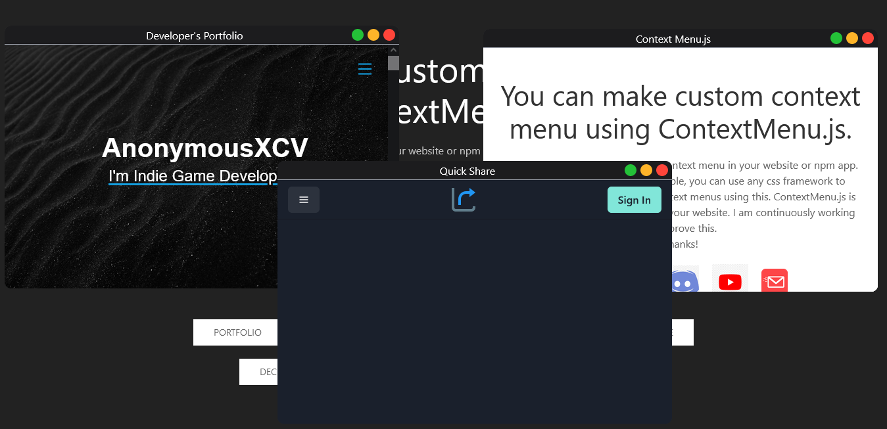
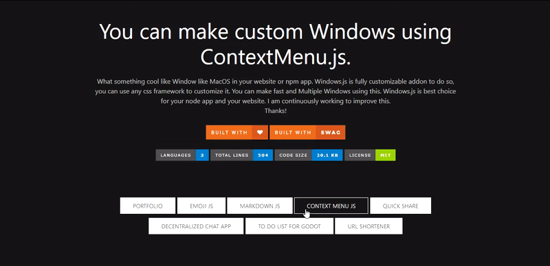

# Windows.js

<div align="center">
<i>
  What something cool like Window like MacOS in your website or npm app.
                Windows.js is fully customizable addon to do so, you can use any css framework to customize it. You can make fast and Multiple Windows using this. Windows.js is best choice for your node app and your website. I am continuously working to improve this.<br>
                Thanks!
                </i>
  </div>

# Demos




# Documentation

```Javascript
const Portfolio = new Win({
    x: 0,
    y: 0,
    id: "XYZ",
    width: "600px",
    height: "400px",
    title: "Developer's Portfolio",
    draggable: true,
    maximized: false,
    content: `<iframe src="https://anonymousxc.github.io/ItsMeOnly/" frameborder="0" width="100%" height="98%"></iframe>`
});
Portfolio.add();
Portfolio.show();
```

**Properties**

  - x :- (int) X Coordinate of Window on creation.
  - y :- (int) Y Coordinate of Window on creation.
  - id :- (String) The id of every window part.
  - width :- (String) Any valid CSS value.
  - height :- (String) Any valid CSS value.
  - title :- (String) The title of the window.
  - draggable : (Boolean) Set Drag for window.
  - maximized : (Boolean) Maximized on create.
  - content : (String) The HTML inside the window or window content.

**Functions**
- add :- Adds the window to DOM.
- show :- Displays the window.
- addShow :- Adds and shows the window.
- unminimize :- Unminimizes the window.
- getIDs :- Returns an array of id of all element.

## About
Check more about me [here](https://github.com/AnonymousXC)